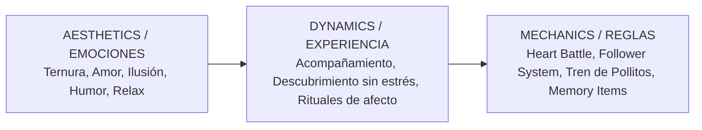
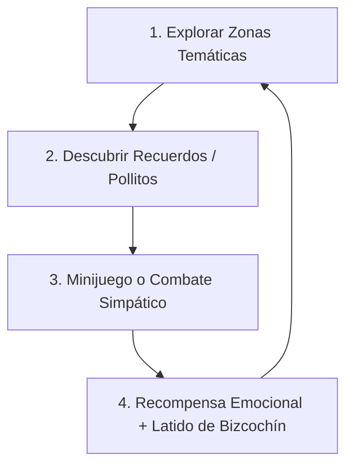

# GAME DESIGN DOCUMENT (GDD)
# POKÉMON: EDICIÓN BIZCOCHÍN (Nana Version)
> **Rol:** Game Designer Senior (Systems, Mechanics & Game Feel)  
> **Objetivo:** Definición integral de mecánicas, sistemas de juego y ritmo sin dependencias técnicas.  
> **Target Player:** Cristina (Experiencia fluida, reconfortante, emotiva, cero frustración, ~45-60 min).

---

## 1. MARCO MDA (Mechanics - Dynamics - Aesthetics)

Diseñamos la experiencia de forma **invertida (A → D → M)**: desde la emoción que debe sentir Cristina hasta las reglas y números que la generan.



### 1.1. Estéticas MDA (Las emociones objetivo)
1. **Compañerismo & Afecto:** Sentir en todo momento que Alberto y sus Pokémon están a su lado apoyándola.
2. **Descubrimiento & Nostalgia:** Revivir anécdotas reales de su vida en pareja convertidas en sorpresas jugables.
3. **Ternura ("Cuteness Overload"):** Animaciones adorables, sonidos de pollitos y atmósfera mágica.
4. **Victoria Emocional:** El clímax no consiste en "derrotar", sino en "acoger y amar".

---

## 2. CORE LOOP Y CURVA DE SESIÓN (45 - 60 Minutos)

El bucle central de juego está optimizado para un ritmo ágil, sin tiempos muertos ni necesidad de "grindear" o farmear experiencia.



### 2.1. Curva de Ritmo y Tiempo

| Tramo | Zona | Verbo Principal | Reto / Dinámica | Recompensa |
| :--- | :--- | :--- | :--- | :--- |
| **00 - 10 min** | Villa Ñaños | *Despertar / Elegir* | Explorar casa, recibir felicitaciones, elegir inicial (Torchic pollito). | *Nana Ball + Compañero* |
| **10 - 25 min** | Ruta 1 | *Descubrir / Charlar* | Combate festivo con amigos, recoger ítems de citas pasadas. | *Recuerdos + Pociones Dulces* |
| **25 - 35 min** | Ciudad Ternura | *Resolver / Reír* | Puzle de preguntas de pareja + Gimnasio de la Paciencia. | *Medalla Ternura + Primer Latido* |
| **35 - 45 min** | Bosque de Nanas | *Guiar / Escuchar* | Minijuego: El "Tren de Pollitos Cantores". | *Desbloqueo del Puente* |
| **45 - 52 min** | Puente del Mañana | *Luchar / Emocionar* | Combate de amor con Alberto (intercambio de piropos/buffs). | *Acceso al Santuario* |
| **52 - 60 min** | Cima de la Cuna | *Vincular / Atrapar* | Ritual de Amor con Bizcochín (Cantar, Acariciar, Prometer). | *¡Captura de Bizcochín + Carta Final!* |

---

## 3. SISTEMA DE MOVIMIENTO Y COMPAÑEROS ("FOLLOWER SYSTEM")

Para maximizar la ternura y la sensación de compañía constante:

### 3.1. El Compañero Activo
* El Pokémon inicial (ej. **Torchic** con su aspecto de pollito) camina siempre detrás de Cristina en el supramundo (*Overworld*).
* **Animación de Reacción:** Al pulsar el botón de interacción mirando al compañero:
  * Aparece un bocadillo con un icono: **Corazón ♥**, **Música ♪** o **Bombilla 💡**.
  * Emite su sonido característico (*«¡Pío, pío!»* o saltitos de alegría).

### 3.2. Mecánica del "Tren de Pollitos" (Bosque de las Nanas)
* En el Bosque de las Nanas hay 3 pollitos extraviados.
* **Mecánica:** Al hablar con cada pollito, este emite una nota musical (*Do, Mi, Sol*) y se engancha automáticamente a la cola del jugador.
* Cristina termina caminando con una fila india de 4 criaturas (Cristina → Torchic → Pollito 1 → Pollito 2 → Pollito 3).
* Al llevar los 3 pollitos a la puerta del puente, los pollitos cantan al unísono una nana y abren el portal dorado.

---

## 4. SISTEMA DE COMBATE: "HEART BATTLE ENGINE"

Modificación del combate por turnos tradicional para adaptarlo a la filosofía de cero frustración y máxima conexión emocional.

### 4.1. Reglas Generales de Combate
* **Sin muerte ni desmayo punitivo:** Los Pokémon nunca se "debilitan" de forma triste; cuando sus puntos bajan, "se van a descansar a su mantita" o se activan auto-curas de amor.
* **Progresión Automática:** Cristina y sus Pokémon suben de nivel automáticamente tras cada evento clave (no hay farmeo aleatorio).

---

### 4.2. Tipos de Encuentros

#### Tipo A: Combates Amistosos (Amigos de Villa Ñaños / Ruta 1)
* **Objetivo:** Celebrar el cumpleaños.
* **Ataques divertidos:**  
  * *Tarta Sorpresa* (Lanza confeti, cura PS).  
  * *Chiste Malo* (Reduce el ataque del rival entre risas).  
  * *Abrazo Veloz* (Prioridad alta, genera buen humor).

---

#### Tipo B: El Combate con Alberto (Rival de Amor - Puente del Mañana)
* **Dinámica Única ("Bucle de Apoyo"):**  
  * Los ataques de Alberto **no buscan noquear**, sino que están diseñados como un diálogo en combate.
  * Cada turno de Alberto viene acompañado de un *Bark* (mensaje de texto en pantalla):  
    * *Turno 1:* «¡Eres la persona más fuerte que conozco!» → Su ataque sube la defensa especial de Cristina.  
    * *Turno 2:* «¡Hacemos el mejor equipo del mundo!» → Aumenta el ataque de Cristina.  
  * Cuando Cristina gana, Alberto aplaude y no hay pantalla de derrota: hay una animación de abrazo y fuegos artificiales.

---

#### Tipo C: El Ritual Legendario de Bizcochín (Cima de la Cuna)
En lugar de una barra de vida (HP) que hay que reducir, Bizcochín tiene una **Barra de Sintonía de Amor (0% → 100%)**.

```
┌─────────────────────────────────────────────────────────────┐
│  BIZCOCHÍN Lv. 1                                           │
│  Sintonía de Amor: [████████████░░░░░░░░] 60%               │
└─────────────────────────────────────────────────────────────┘
```

**Matriz de Acciones de Cristina:**

| Acción | Efecto en la Sintonía | Animación / SFX | Respuesta de Bizcochín |
| :--- | :--- | :--- | :--- |
| **1. Cantar Nana** | +30% Sintonía | Notas musicales doradas flotando. | Cierra los ojitos y se balancea felizmente (*«¡Pío-pum!»*). |
| **2. Caricia Cálida** | +35% Sintonía | Destello de corazones rosados. | Da una voltereta en el aire y se acerca a Cristina. |
| **3. Promesa de Futuro** | +40% Sintonía | Aura dorada brillante en toda la pantalla. | El latido de Bizcochín se acelera de alegría pura. |
| **4. Lanzar NANA BALL** | Requiere ≥ 80% Sintonía | Lanzamiento suave con estela de estrellas. | **Captura garantizada al 100% (0 sacudidas, clic instantáneo).** |

---

## 5. DISEÑO DE PUZLES Y MINIJUEGOS

Todos los puzles están diseñados bajo la regla: **"Cero frustración, 100% sonrisa"**.

### 5.1. Puzle del Gimnasio: "El Test de la Paciencia y la Risa"
* **Estructura:** Sala con tres puertas custodiadas por estatuas decoradas con pollitos.
* **Mecánica:** Cada puerta hace una pregunta simpática sobre la vida juntos:
  1. *Pregunta 1:* ¿Quién tarda más en elegir qué ver en Netflix?  
     * Opciones: `[A: Cristina]` `[B: Alberto]` `[C: Se quedan dormidos antes de elegir]`  
     * *Resultado:* Cualquier opción abre la puerta con un comentario cómico.
  2. *Pregunta 2:* ¿Cuál es el ingrediente secreto para superar cualquier día difícil?  
     * Opciones: `[A: Un abrazo a tiempo]` `[B: Reírse de todo]` `[C: Un bizcochito rico]`  
     * *Resultado:* ¡Todas son correctas y activan confeti!

---

## 6. SISTEMA DE OBJETOS ("MEMORY & LOVE INVENTORY")

El inventario de Cristina se divide en tres pestañas accesibles y limpias:

```
┌─────────────────────────────────────────────────────────────┐
│ INVENTARIO                                                  │
│ [ 1. OBJETOS DE AMOR ]   [ 2. RECUERDOS ]   [ 3. BAYAS ]    │
└─────────────────────────────────────────────────────────────┘
```

### 6.1. Objetos de Amor (Claves)
* **Nana Ball:** Bola legendaria tejida con amor. Imposible de vender o tirar. Captura asegurada.
* **Gorro Pollital:** Regalo de Alberto al salir de casa. Puedes equipárselo al sprite de Cristina para que lleve un gracioso gorrito de pollito con cresta amarilla.
* **Medalla Ternura:** Otorgada por Don Valentín. Al examinarla en la mochila, reproduce el sonido de un latido suave (*¡Pum-pum!*).

### 6.2. Coleccionables de Recuerdos (Storylets pasivos)
* Al interactuar con puntos brillantes del mapa se recogen ítems que no ocupan espacio de combate, sino que abren una ventana con una foto/ilustración pixelada y una frase entrañable:
  * *Entrada de Cine Desgastada:* «Recuerdo de vuestras primeras citas.»
  * *Llavero de Viaje:* «Recuerdo de aquella escapada donde todo fue perfecto.»
  * *Chupete Dorado:* «Una señal de que lo mejor de vuestras vidas está a punto de llegar.»

---

## 7. DIRECCIÓN DE GAME FEEL & AUDIO FEEDBACK

1. **Vibración / Screen Shake Suave:**  
   * En los momentos en que se escucha el latido de Bizcochín (*¡Pum-pum!*), la pantalla y el mando vibran al unísono con el ritmo cardíaco.
2. **Paleta de Color y Transiciones:**  
   * Villa Ñaños: Tonos pastel cálidos, mañaneros y luminosos.  
   * Bosque de Nanas: Violetas y azules noche con puntos de luz dorada viva.  
   * Cima de la Cuna: Blanco brillante, dorados y nubes esponjosas.
3. **SFX Clave:**  
   * *Sonido de interacción positiva:* Campanita dulce de victoria.  
   * *Sonido de pollito:* «¡Pío!» agudo y tierno cada vez que se descubre un secreto.  
   * *Sonido de captura:* Fanfarria clásica de Pokémon remezclada con instrumentos de caja de música infantil.

---

## 8. RESUMEN DE PRODUCIBILIDAD (Checklist de Diseño)

* [x] **Sin estados de Game Over:** Si el jugador falla un combate amistoso, el rival simplemente le ofrece una poción y le anima a volver a intentarlo de inmediato.
* [x] **Economía simple:** No hay tiendas complejas ni necesidad de gestionar dinero; los objetos se regalan con cariño a lo largo de la ruta.
* [x] **Ritmo medido:** Duración total calculada entre 45 y 55 minutos para que se juegue del tirón durante el día de su cumpleaños.
* [x] **Recompensa final integrada:** La transición directa entre la captura del legendario, la entrada de la Pokédex y la carta personalizada de Alberto.
